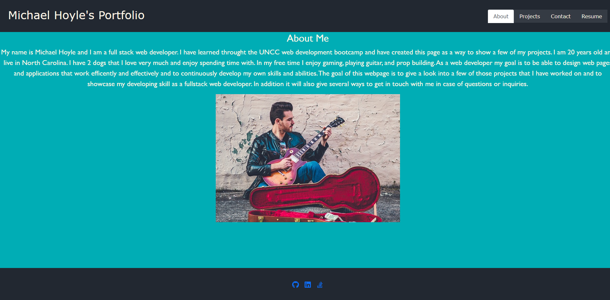

# react-portfolio 

## Description
This was an example of a react portfolio for myself. It has a navigation with an About Me page, a Projects page, Contact page, and a Resume page. The about me page just gives a little information about myself. The projects page gives a look at 6 of the projects I've done over the last few months. The contact page includes a contact form to leave an email and a comment for me to see. The resume page has a link to my resume and a list of all the technologies I'm proficent in. The footer of the page has links to my GitHub, LinkedIn, and Stack Overflow accounts. The react app also uses bootstrap to help with styling and fontawesome for some of the icons. 

## Installation 

    npm install 
    npm start

## GitHub Repository 

The GitHub repository can be found [here.](https://github.com/choyle-01/react-portfolio)

## Deployed Link

The deployed link for the site can be found [here.](https://choyle-01.github.io/react-portfolio/)

## Visuals 

